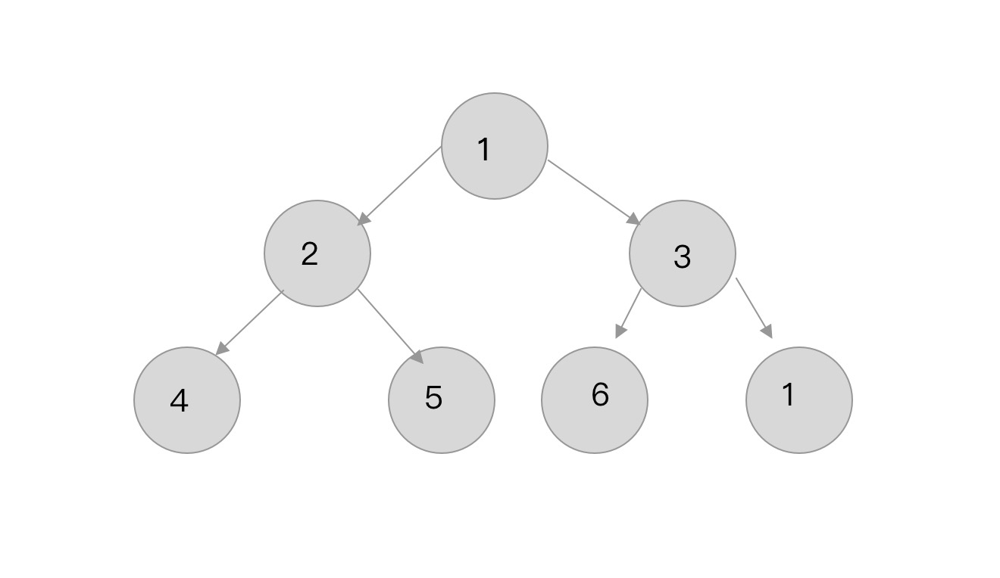

## 二叉树 ##
> 1. 每个节点中的值必须要小于等于右子数的值
> 2. 每个节点中的值必须要大于等于左子树的值
> 3. 如果左子树不为空, 则左子树节点的值都小于根节点
> 4. 如果它的右子树不为空,则右子树节点的值都大于根节点
> 5. 子树的子树遵循相同的规律

#### 前序遍历: ####
> 先访问根节点 再前序遍历左子树 再前序遍历右子树
 
#### 中序遍历 ####
 > 先中序遍历左子树 再访问根节点 最后中序遍历右子树
 
#### 后序遍历 ####
 > 先后续遍历左子树 再后续遍历右子树， 最后访问根节点

#### 怎么记遍历方式? #### 
 前中后其实表示的是根节点的访问时间
 
 ruby -run -e httpd . -p 8888
 
 <!-- 算法模板核心思想是 提供一套统一的解题的公式 -->

```go
package node
type Node struct {
    LeftNode  *Node
    RightNode *Node
    Val       int
}
```

## 前序遍历 ##


#### 使用递归 ####

```go
package traversal

type TreeNode struct {
    LeftNode  *TreeNode
    RightNode *TreeNode
    Val       int
}

func preOrderTraversal(root *TreeNode){
    if root == nil{
        return
    }

    fmt.Println(root.Val)
    preOrderTraversal(root.LeftNode)
    preOrderTraversal(root.RightNode)
}
```

#### 非递归 ####
```go
func preOrderTraversal(root *treeNode) {
    if root == nil{
        return nil
    }
    stack := make([]*Node, 0)

    for root != nil || len(stack) != 0 {
        for root != nil {
            fmt.Println(root.Val)
            statck = append(stack, root)
            root = root.LeftNode
        }
        node := stack[len(stack)-1]
        stack = stack[:len(stack)-1]
        root = node.RightNode
    }
}
// 1 -> 2 -> 4 -> 5 -> 3 -> 6 -> 7
```


## 中序遍历 ##



#### 中序非递归

```go
func inOrderTraversal(root * treeNode) {
    if root == nil {
        return 
    }
    stack := make([]*Node, 0)
    for(root != nil ) || len(stack) > 0 {
        for root != nil {
            stack = append(stack, root)
            root := root.LeftNode
        }
        //
        node := stack[len(stack) - 1]
        stack := stack[:len(stack)-1]
        fmt.Println(node.Val)
        root := node.RightNode
    }
}

// 4 -> 2 -> 5 -> 1 -> 3 -> 6 -> 7
```


## 后续遍历 ##

#### 后续非递归遍历

```go
func afterOrderTraversal(root *treeNode){
    if root == nil {
        return
    }
    
    stack := make([]*Node, 0)
    var lastVisit *Node
    for(root != nil || len(stack) > 0) {
        for root != nil {
            stack = append(stack, root)
            root = root.LeftNode
        }

        node := stack[len(stack) - 1]
        if node.RightNode == nil || node.RightNode == lastVisit {
            stack = stack[:len(stack) - 1]
            fmt.Println(node.Val)
            lastVisit = node
        } else {
            root := node.RightNode
        }
    }
}
// 4 -> 5 -> 2 -> 6 -> 7 > 3 -> 7
```
> 后续遍历的思想: 首先是一直遍历左边的节点到最后一个节点, 
> 拿出最后一个节点, 判断该节点有没有右边的节点, 如果有继续下去
> 找到树的最后一层的节点
> 如果没有右边的节点, 或者 是最后一个访问的节点 都可打印并且推出栈


## 按照层级遍历 ## 
```go
package treeNode

type TreeNode struct {
    Left  *TreeNode
    Right *TreeNode
    Val       int
}
func orderHierarchy(root *TreeNode) {
    if root == nil {
        return
    }   
    queue := make([]*TreeNode, 0)
    queue = append(queue, root)
    for len(queue) > 0 {
        tmpQueue := make([]*TreeNode, 0)
        for _, v := range queue {
            if v.Left != nil {
                tmpQueue = append(tmpQueue, v.Left)
            }
            if v.Right != nil {
                tmpQueue = append(tmpQueue, v.Right)
            }  
        }   
        queue = tmpQueue
    }
}
// 其中tmpQueue中保存的就是二叉树当前层所有节点
// 顺序是从上至下
```

## DFS 深度搜索 从下向上(分治法) ##

```go
func divideAndTraversal(root *Node){
    if root == nil {
        return
    }
    divideAndTraversal(root.LeftNode)
    divideAndTraversal(root.RightNode)
    
    fmt.Println(root.Val)
}
```

> 注意: 深度搜索(从上到下)和分治法的区别, 前者一般将最终结果通过指针参数传入
> 后者是递归返回结果最后合并

## BFS 广度搜索 层次遍历 ##

```go
func levelOrder(root *Node) {
    if root == nil {
        return
    }

    quene := make([]*Node, 0)
    quene = append(quene, root)

    for len(quene) > 0{
        l := len(quene)
        for i := 0 ; i < l; i ++ {
            level := quene[0]
            quene = quene[1:]
            fmt.Println(level.Val)
            if level.LeftNode != nil {
                quene = append(quene, level.LeftNode)
            }
            if level.RightNode != nil {
                quene = append(quene, level.RightNode)
            }
        }
    }
}
```

## 归并排序 ##

```go
func MergeSort(nums []int) []int {
    return mergeSort(nums)
}

func mergeSort(nums []int) []int{
    if len(nums) <= 1 {
      return nums
    }

    mid := len(nums) / 2

    left := mergeSort(nums[:mid])
    right := mergeSort(nums[mid:])

    result := merge(left, right)
    return result
}

func merge(left, right []int)(result []int){
  var l, r := 0, 0 
  
  for (l < len(left)) && r < len(right) {
    if left[l] > right[r] {
      result = append(result, right[r])
      r++
    } else {
      result = append(result, left[l])
      l++
    }
  }
  result = append(result, left[l:]...)
  result = append(result, right[r:]...)
  return
}
```

// 代码的核心思想
比较有序数组并且合并成一个结果
特别是这部分

```go
for (l < len(left)) && r < len(right) {
    if left[l] > right[r] {
      result = append(result, right[r])
      r++
    } else {
      result = append(result, left[l])
      l++
    }
}
result = append(result, left[l:]...)
result = append(result, right[r:]...)
两个数组 从低位开始依次比较， 最后单独剩余的部分不再比较（直接合并）， 返回结果集
```

## 快速排序 ##

```go
func QuickSort(nums []int) []int {
    quickSort(nums, 0, len(nums)-1)
    return nums
}

func quickSort(nums []int, start, end int){
    if start < end {
        // 分治法
        prvot := partition(nums, start, end)
        quickSort(nums, 0, pivot-1)
        quickSort(nums, pivot+1, end)
    }
}

func partition(nums []int, start, end int) int {
    p, i := nums[end], start

    for j := start; j < end; j++ {
        if nums[j] < p {
            swap(nums, i, j)
            i++
        }
    }
    swap(nums, i, end)
    return i
}

func swap(nums []int, i, j int){
    t := nums[i]
    nums[i] = nums[j]
    nums[j] = t
}
```

> 快排的核心思想:
> 和合并排序不相同， 合并排序是递归返回结果集
> 快排的核心是改变结果集
